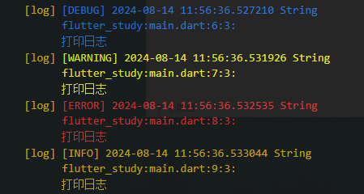

- 实现效果预览

  

- 导包，使用的是 `dart:developer`中的 log 方法，以及用到了`package:flutter/foundation.dart`中的 `StackFrame`

```dart
import 'dart:developer';
import 'package:flutter/foundation.dart';
```

- 创建一个枚举类型，用于表示日志级别，以及 ANSI 转义序列颜色

```dart
/// 日志级别枚举
enum LogLevel {
  debug,
  warning,
  error,
  info,
}
/// ANSI 转义序列颜色
const String reset = '\x1B[0m';
const String blue = '\x1B[34m';
const String orange = '\x1B[33m';
const String red = '\x1B[31m';
```

- 根据日志级别返回不同的颜色

```dart
/// 根据日志级别返回不同的颜色
String _getLogLevelColor(LogLevel level) {
  switch (level) {
    case LogLevel.debug:
      return blue;
    case LogLevel.warning:
      return orange;
    case LogLevel.error:
      return red;
    case LogLevel.info:
      return reset;
  }
}
```

- 格式化堆栈帧信息

```dart
String _formatStackFrame(StackFrame frame) {
  return '#${frame.source} ${frame.package}:${frame.packagePath}:${frame.line}:${frame.column}';
}
```

- 日志消息格式化

```dart
String _formatLogMessage(
    Object? object,
    LogLevel level,
    StackFrame frame,
) {
    final color = _getLogLevelColor(level);
    final formattedTime = DateTime.now().toString();
    final formattedType = object?.runtimeType ?? 'Unknown';

return '''
$color[${level.name.toUpperCase()}] $formattedTime $formattedType
${frame.package}:${frame.packagePath}:${frame.line}:${frame.column}:
$object
''';
}
```

```dart
/// 日志打印基础方法
void _logMessage(
Object? object,
LogLevel level, {
bool fullStack = false,
}) {
if (!kDebugMode) return;

final frames = StackFrame.fromStackTrace(StackTrace.current);
final formattedMessage = _formatLogMessage(object, level, frames[2]);

// 打印日志
log(formattedMessage, level: 0);

if (fullStack) {
final stackFrames = frames.skip(2).map(_formatStackFrame).toList();
final stackTraceStr = stackFrames.join('\n');
log(stackTraceStr, level: 0);
}
}
```

- 封装日志打印方法

```dart
/// 打印调试级别的日志
void logDebug(Object? object, {bool fullStack = false}) {
_logMessage(object, LogLevel.debug, fullStack: fullStack);
}

/// 打印警告级别的日志
void logWarning(Object? object, {bool fullStack = false}) {
_logMessage(object, LogLevel.warning, fullStack: fullStack);
}

/// 打印错误级别的日志
void logError(Object? object, {bool fullStack = false}) {
_logMessage(object, LogLevel.error, fullStack: fullStack);
}

/// 打印信息级别的日志
void logInfo(Object? object, {bool fullStack = false}) {
_logMessage(object, LogLevel.info, fullStack: fullStack);
}

```

- 源码

```dart
import 'dart:developer';
import 'package:flutter/foundation.dart';

/// 日志级别枚举
enum LogLevel {
  debug,
  warning,
  error,
  info,
}

/// ANSI 转义序列颜色
const String reset = '\x1B[0m';
const String blue = '\x1B[34m';
const String orange = '\x1B[33m';
const String red = '\x1B[31m';

/// 根据日志级别返回不同的颜色
String _getLogLevelColor(LogLevel level) {
  switch (level) {
    case LogLevel.debug:
      return blue;
    case LogLevel.warning:
      return orange;
    case LogLevel.error:
      return red;
    case LogLevel.info:
      return reset;
  }
}

/// 格式化堆栈帧信息
String _formatStackFrame(StackFrame frame) {
  return '#${frame.source} ${frame.package}:${frame.packagePath}:${frame.line}:${frame.column}';
}

/// 日志消息格式化
String _formatLogMessage(
  Object? object,
  LogLevel level,
  StackFrame frame,
) {
  final color = _getLogLevelColor(level);
  final formattedTime = DateTime.now().toString();
  final formattedType = object?.runtimeType ?? 'Unknown';

  return '''
$color[${level.name.toUpperCase()}] $formattedTime $formattedType
${frame.package}:${frame.packagePath}:${frame.line}:${frame.column}:
$object
''';
}

/// 日志打印基础方法
void _logMessage(
  Object? object,
  LogLevel level, {
  bool fullStack = false,
}) {
  if (!kDebugMode) return;

  final frames = StackFrame.fromStackTrace(StackTrace.current);
  final formattedMessage = _formatLogMessage(object, level, frames[2]);

  // 打印日志
  log(formattedMessage, level: 0);

  if (fullStack) {
    final stackFrames = frames.skip(2).map(_formatStackFrame).toList();
    final stackTraceStr = stackFrames.join('\n');
    log(stackTraceStr, level: 0);
  }
}

/// 打印调试级别的日志
void logDebug(Object? object, {bool fullStack = false}) {
  _logMessage(object, LogLevel.debug, fullStack: fullStack);
}

/// 打印警告级别的日志
void logWarning(Object? object, {bool fullStack = false}) {
  _logMessage(object, LogLevel.warning, fullStack: fullStack);
}

/// 打印错误级别的日志
void logError(Object? object, {bool fullStack = false}) {
  _logMessage(object, LogLevel.error, fullStack: fullStack);
}

/// 打印信息级别的日志
void logInfo(Object? object, {bool fullStack = false}) {
  _logMessage(object, LogLevel.info, fullStack: fullStack);
}

```
